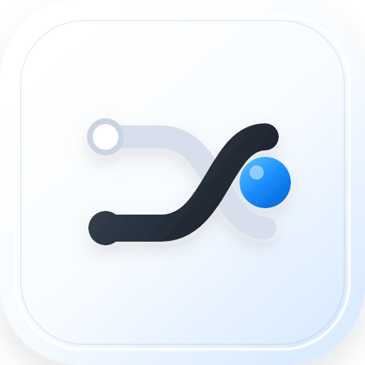
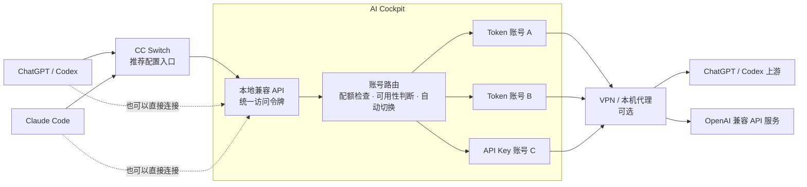
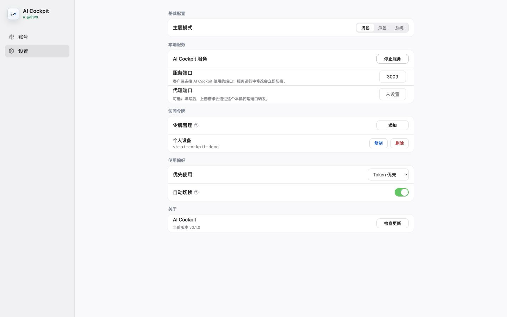

<p align="center">
  
</p>

<h1 align="center">AI Cockpit</h1>

<p align="center">
  集中管理多个 ChatGPT/Codex 账号，通过一个本地 API Key 为 AI 客户端提供稳定、可切换的统一入口。
</p>

<p align="center">
  <a href="https://github.com/iiiiuuuuuu/ai-cockpit/releases/latest"><strong>下载最新版本</strong></a>
  ·
  <a href="#快速开始">快速开始</a>
  ·
  <a href="#客户端配置">客户端配置</a>
</p>

<p align="center">
  
  
</p>

## 一个入口，管理多个 AI 账号

AI Cockpit 是一个桌面端 AI 账号管理与本地请求路由应用。

它在本机提供统一的兼容 API。ChatGPT 应用中的 Codex 功能和 Claude Code 只需要配置一次 AI Cockpit 的 Base URL 和访问令牌；具体使用哪个账号、什么时候检查配额、账号不可用时如何切换、请求是否经过代理，都由 AI Cockpit 在本机处理。推荐使用 CC Switch 管理客户端配置，也可以直接配置客户端。

适合以下场景：

- 同时使用多个 ChatGPT/Codex Token 账号，希望统一查看配额和可用状态。
- 同时管理 Token 与 OpenAI 兼容 API Key，需要按偏好选择或兜底。
- 希望客户端只保存一个本地访问令牌，不直接暴露每个上游账号的凭证。
- 使用 CC Switch 管理不同 AI 客户端，希望增加一层本地账号调度。
- 需要把账号从 macOS 迁移到 Windows，或从 Windows 迁移到 macOS。

## 请求如何经过 AI Cockpit



CC Switch 是推荐接入方式，但不是必需组件。ChatGPT 应用中的 Codex 功能和 Claude Code 都可以直接连接 AI Cockpit。ChatGPT 普通对话不经过这里配置的 Base URL。

## 核心能力

### 多账号管理

- 支持 ChatGPT/Codex Token 账号和 OpenAI 兼容 API Key 账号。
- 支持添加、编辑、删除、恢复、搜索、筛选和自定义排序。
- 清楚标记当前使用账号、不可用账号和禁止自动切入的账号。

### 配额与可用状态

- Token 账号展示 5 小时配额和周配额。
- 后台定期检查未删除的 Token 账号，最多同时检查 2 个账号。
- 展示最近检查时间、不可用原因和账号切换原因。
- API Key 账号可手动探测上游是否可用。

### 账号选择与自动切换

- 支持 Token 优先、API Key 优先、仅 Token、仅 API Key 四种使用偏好。
- 当前账号仍可用时保持不变，避免无意义切换。
- 当前 Token 不可用时，优先选择 5 小时配额更高的可用账号。
- 优先模式没有可用账号时，可按使用偏好使用另一种账号模式兜底。

### 统一的本地 API Key

- AI Cockpit 自动生成客户端访问令牌。
- 客户端无需保存各个 Token、Refresh Token 或上游 API Key。
- 可以创建多个访问令牌，并随时复制或删除。

### 批量导入、导出与跨设备迁移

- 支持导入单个 JSON、多个独立 JSON 或包含多个账号的 JSON。
- 导入前检查重复账号，并预览新增、更新或跳过结果。
- 可以选择未删除账号、已删除账号或指定账号批量导出。
- macOS 和 Windows 使用相同导出格式，可以双向迁移。

### 桌面端体验

- 支持 macOS 和 Windows。
- 支持浅色、深色和跟随系统主题。
- 支持系统托盘；关闭窗口时应用继续在后台运行。
- 可以在 App 内启动或停止本地服务，并检查 GitHub Release 更新。

## 应用界面

### 账号首页

首页集中展示账号类型、当前使用状态、配额、最近检查结果和常用操作。


### 设置页面

设置页用于管理本地服务、端口、代理、访问令牌、使用偏好、自动切换和主题模式。



截图使用内置演示数据，不包含真实账号或访问令牌。

## 下载与安装

前往 [GitHub Releases](https://github.com/iiiiuuuuuu/ai-cockpit/releases/latest) 下载对应安装包。

| 系统 | 设备 | 安装包 |
| --- | --- | --- |
| macOS | Apple Silicon，M1/M2/M3/M4 | `AI_Cockpit_<version>_arm64.dmg` |
| macOS | Intel Mac | `AI_Cockpit_<version>_x64.dmg` |
| Windows | Windows 10/11 64 位 | `AI_Cockpit_<version>_x64-setup.exe` |

### macOS

1. 下载与你的 Mac 架构匹配的 DMG。
2. 双击打开 DMG。
3. 将 `AI Cockpit.app` 拖入“应用程序”。
4. 从“应用程序”打开 AI Cockpit。

当前安装包未经过 Apple 公证。如果 macOS 提示无法验证开发者，请进入“系统设置 → 隐私与安全性”，确认应用来源后选择“仍要打开”。

系统要求：macOS 11 或更高版本。

### Windows

1. 下载 `AI_Cockpit_<version>_x64-setup.exe`。
2. 双击安装包，按照安装向导完成安装。
3. 从开始菜单打开 AI Cockpit。

如果 Windows SmartScreen 提示未知发布者，请先确认安装包来自本仓库的 GitHub Releases，再选择“更多信息 → 仍要运行”。

AI Cockpit 已内置运行所需组件，不需要另外安装 Node.js，也不需要通过命令行启动。

## 快速开始

### 使用前：确认网络

如果当前网络无法直接访问 ChatGPT/Codex 或 Claude Code，请先配置 VPN 或网络代理。推荐使用 Clash Verge Rev 的“规则模式 + TUN/虚拟网卡模式”，这样客户端和 AI Cockpit 可以统一使用相同网络环境，AI Cockpit 的代理端口通常保持“未设置”。

完整的下载安装、订阅导入、节点选择和启用步骤见 [网络与代理配置](docs/网络与代理配置.md#推荐的首次使用流程)。

### 1. 添加账号

打开 AI Cockpit，在账号页点击“添加账号”。

**Token 模式**适合 ChatGPT/Codex 登录账号，推荐通过以下任一方式导入：

- 使用无痕窗口登录 [ChatGPT](https://chatgpt.com/)，再打开 [AuthSession](https://chatgpt.com/api/auth/session) 并复制返回的 JSON。
- 登录 ChatGPT/Codex 应用后，复制 `.codex/auth.json` 中的账号登录信息。

常见文件位置：

```text
macOS:   ~/.codex/auth.json
Windows: %USERPROFILE%\.codex\auth.json
```

**API Key 模式**适合 OpenAI 官方接口或第三方 OpenAI 兼容中转服务。填写服务商提供的 Base URL 和 API Key 即可。

所有导入和解析都在本机完成。

### 2. 配置本地服务

进入“设置”：

- 服务端口默认是 `3009`。
- 不使用代理时，代理端口保持“未设置”。
- 使用本机代理软件的 HTTP/Mixed 端口时，填写软件显示的实际端口，例如 `7897`。
- 已启用 TUN/虚拟网卡模式时，通常保持代理端口“未设置”即可。

代理端口的作用、Clash Verge Rev 配置方法和工具选择见 [网络与代理配置](docs/网络与代理配置.md)。

### 3. 生成访问令牌

在“访问令牌”中点击“添加”。AI Cockpit 会随机生成一个本地访问令牌。

客户端连接 AI Cockpit 时使用这个令牌，不要填写 ChatGPT Access Token 或上游 API Key。

### 4. 设置账号使用偏好

根据需要选择：

- Token 优先
- API Key 优先
- 仅 Token
- 仅 API Key

不希望某个账号成为自动切换目标时，可以在账号卡片中禁止自动切入。

### 5. 启动服务

点击“启动服务”。状态变为“运行中”后，客户端才可以连接 AI Cockpit。

打开 App 不会自动启动服务。停止服务只会关闭本地 API 入口，不会删除账号和配置。

### 6. 连接客户端

推荐在 CC Switch 中分别为 ChatGPT/Codex 或 Claude Code 新增自定义 Provider，并填写 AI Cockpit 的 Base URL 和访问令牌。也可以直接在客户端中完成相同配置。

## 客户端配置

### 推荐：通过 CC Switch 配置

[CC Switch](https://github.com/farion1231/cc-switch/) 提供可视化的客户端供应商管理，可以避免手动编辑配置文件。前往 [CC Switch 最新版本下载页面](https://github.com/farion1231/cc-switch/releases/latest)，macOS 下载对应芯片架构的 `.dmg`，Windows 下载 `.exe` 或 `.msi` 安装包。

安装后，在 Codex 或 Claude 页面添加自定义供应商：

| 客户端 | API 地址 | API Key / Auth Token |
| --- | --- | --- |
| ChatGPT / Codex | `http://127.0.0.1:3009/v1` | AI Cockpit 生成的访问令牌 |
| Claude Code | `http://127.0.0.1:3009` | AI Cockpit 生成的访问令牌 |

保存后切换到 `AI Cockpit`。Codex 需要重新打开才能读取新配置；Claude Code 未立即生效时也请重新打开。CC Switch 在这里仅负责管理客户端配置，不需要开启其本地代理或路由接管。

完整的下载安装、界面填写和手动配置步骤见 [客户端接入指南](docs/客户端接入指南.md)。

### 不通过 CC Switch 直接配置

ChatGPT/Codex 和 Claude Code 也支持直接编辑本地配置文件。由于不同系统的配置位置、令牌保存方式和生效方式不同，请按照 [客户端接入指南](docs/客户端接入指南.md#不通过-cc-switch-直接配置) 操作。

## 账号模式

### Token 模式

适合 ChatGPT/Codex 登录账号，支持：

- 5 小时配额和周配额展示。
- 后台额度检查和手动刷新。
- Access Token 失效后的 Refresh Token 续期。
- 按配额和可用状态参与账号选择。

账号在额度不足、额度用尽、订阅失效、凭证失效或检查失败时会被标记为不可用。详细规则见 [账号额度与自动切换](docs/账号额度与自动切换.md)。

### API Key 模式

适合 OpenAI 官方接口或第三方 OpenAI 兼容中转服务，支持：

- 配置独立的 Base URL 和 API Key。
- 作为主要账号模式或 Token 模式的兜底。
- 手动刷新时探测上游可用性。

API Key 账号不展示 ChatGPT 5 小时配额和周配额。

## 批量迁移账号

账号页“添加账号”右侧的菜单提供“批量导入账号”和“批量导出账号”。

导出的文件包含用户选择的 Token 和 API Key 账号，可以直接在另一台 macOS 或 Windows 电脑中导入。导出不会包含：

- 服务端口和代理端口
- AI Cockpit 访问令牌
- 当前使用账号
- 配额、可用状态和最近检查结果
- 主题等本机设置

导出文件默认不加密，并且包含完整账号凭证。请使用安全方式保存和传输，导入完成后及时删除不再需要的导出文件。

完整操作与冲突处理规则见 [账号导入导出与迁移](docs/账号导入导出与迁移.md)。

## 运行方式

- 点击窗口关闭按钮只会隐藏窗口，应用继续在后台运行。
- 可以通过系统托盘图标重新打开窗口。
- 从系统托盘选择“退出”才会真正关闭应用，并停止由该 App 管理的本地服务。
- 服务运行时可以修改服务端口或代理端口，App 会尝试立即同步配置。

## 数据与隐私

AI Cockpit 的账号、凭证、访问令牌和设置保存在本机：

```text
macOS:   ~/Library/Application Support/AI Cockpit/openai.json
Windows: %APPDATA%\AI Cockpit\openai.json
```

安全提醒：

- `openai.json` 包含账号 Token 和上游 API Key，不要上传到代码仓库或发送给他人。
- 账号导出文件默认包含明文凭证，不要通过不可信渠道传输。
- README 截图使用演示数据；提交问题时也请先对账号、邮箱、Token 和访问令牌脱敏。
- AI Cockpit 是本地应用，不提供云端账号同步或托管服务。

## 更多文档

- [客户端接入指南](docs/客户端接入指南.md)
- [网络与代理配置](docs/网络与代理配置.md)
- [账号额度与自动切换](docs/账号额度与自动切换.md)
- [账号导入导出与迁移](docs/账号导入导出与迁移.md)
- [配置字段参考](docs/配置字段参考.md)
