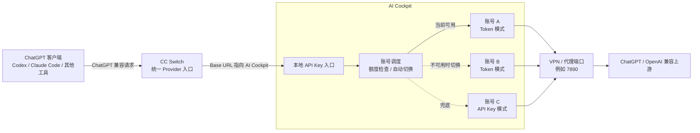
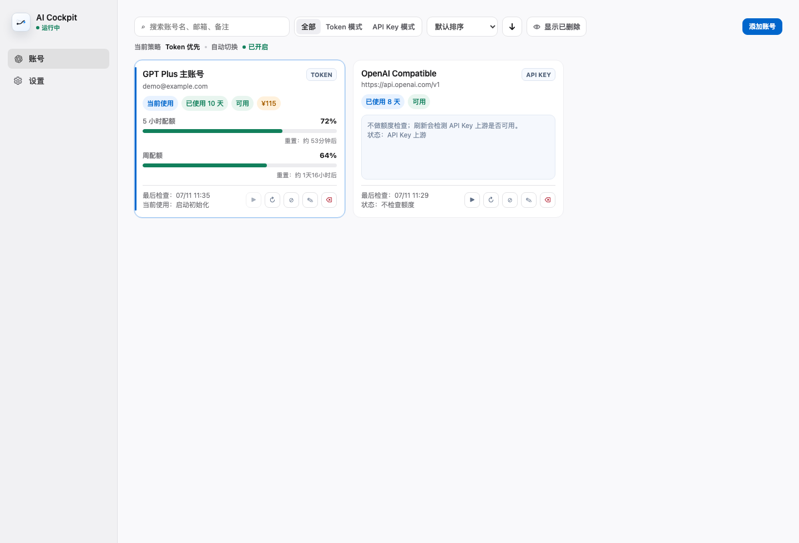

# AI Cockpit

AI Cockpit 是一个 AI 账号管理和本地 API 接入工具。它可以配置多个 ChatGPT/Codex 账号，对外提供一个统一的 API Key 入口；客户端只需要接入 AI Cockpit，具体使用哪个账号、账号不可用时怎么切换、是否通过代理端口转发，都由 AI Cockpit 处理。

## 架构图



AI Cockpit 位于 CC Switch 和 ChatGPT 上游之间：

- 左侧 ChatGPT 客户端只需要通过 CC Switch 指向 AI Cockpit。
- AI Cockpit 对外是一个统一的 API Key 入口。
- AI Cockpit 内部可以配置多个账号，并按配额、可用状态和使用偏好自动切换。
- 如果配置了 VPN/代理端口，请求会通过该端口发送到上游。

## AI Cockpit 可以做什么

- **统一入口**：把多个 ChatGPT/Codex 账号包装成一个本地 API Key 入口。
- **账号管理**：在 App 中添加、编辑、删除、恢复 Token 账号或 API Key 账号。
- **配额展示**：Token 账号会显示 5 小时配额、周配额、可用状态和最近检查结果。
- **自动切换**：当前账号不可用时，按使用偏好自动切换到可用账号。
- **本地服务控制**：在 App 中启动或停止 AI Cockpit 服务。
- **代理配置**：支持配置本机 VPN/代理端口，例如 `7890`。
- **访问令牌管理**：App 自动生成本地访问令牌，客户端以 API Key 方式接入。

## 下载与安装

请前往 [GitHub Releases](https://github.com/iiiiuuuuuu/ai-cockpit/releases) 下载与你的系统和架构对应的安装包。

macOS 安装包：

```text
AI_Cockpit_<version>_arm64.dmg
AI_Cockpit_<version>_x64.dmg
```

安装方式：

1. 下载与你的 Mac 架构匹配的 DMG。
2. 双击打开 DMG。
3. 将 `AI Cockpit.app` 拖到 `Applications`。
4. 从 `Applications` 打开 AI Cockpit。

系统要求：

- macOS 11 或更高版本。
- 不需要安装 Node.js。
- 不需要通过命令行启动。

Windows 使用 `AI_Cockpit_<version>_x64-setup.exe` 安装包。下载后双击安装，按照安装向导完成操作。

## 使用流程



1. 打开 AI Cockpit。
2. 在首页点击“添加账号”，添加 Token 模式或 API Key 模式账号。
3. 进入设置页，确认服务端口，默认 `3009`。
4. 如需 VPN/代理，填写代理端口；不需要则留空。
5. 在“访问令牌”中点击“添加”，生成本地 API Key。
6. 设置“使用偏好”和“自动切换”。
7. 点击“启动服务”。
8. 在 CC Switch 或其他客户端中配置 AI Cockpit 的本地地址和访问令牌。

打开 App 不会自动启动服务。需要客户端能够访问 AI Cockpit 时，请手动点击“启动服务”。停止服务不会删除账号，只会关闭本地 API 入口。

## 客户端配置

OpenAI / Codex 兼容客户端：

```text
Base URL: http://127.0.0.1:3009/v1
API Key:  AI Cockpit 设置页生成的访问令牌
```

Claude / Anthropic 兼容客户端：

```text
Base URL: http://127.0.0.1:3009
API Key:  AI Cockpit 设置页生成的访问令牌
```

如果服务端口不是 `3009`，请把地址中的端口改成设置页里配置的端口。

## 账号模式

### Token 模式

适合使用 ChatGPT/Codex 登录态账号。添加时可以粘贴 ChatGPT AuthSession JSON，也可以手动编辑邮箱、别名、access token、refresh token 等字段。

Token 账号会参与额度检查和自动切换。不可用情况包括：

- 5 小时配额低于 `3%`。
- 周配额小于等于 `1%`。
- 额度已用尽。
- 凭证失效。
- 额度检查失败。
- 账号已标记删除。

### API Key 模式

适合接入 OpenAI 兼容上游或第三方模型网关。客户端不直接拿上游 API Key，而是统一使用 AI Cockpit 生成的本地访问令牌。

API Key 账号不展示 ChatGPT 5 小时配额和周配额；手动刷新时会做可用性探测。

## App 页面

### 首页

首页展示所有账号卡片，支持：

- 搜索账号。
- 按账号类型筛选。
- 按默认顺序、5 小时配额、周配额排序。
- 显示或隐藏已删除账号。
- 查看当前使用账号。
- 编辑、刷新、手动切换、删除或恢复账号。

### 设置页

设置页用于配置本地服务：

- 启动或停止 AI Cockpit。
- 配置服务端口，默认 `3009`。
- 配置代理端口，默认不填写。
- 生成和删除访问令牌。
- 设置使用偏好。
- 开启或关闭自动切换。
- 切换浅色、深色或系统主题。
- 查看当前版本并检查 GitHub Release 更新。

## 本地数据

AI Cockpit 的数据存储在：

```text
macOS:   ~/Library/Application Support/AI Cockpit/
Windows: %APPDATA%\AI Cockpit\
```

其中的 `openai.json` 包含账号、访问令牌、端口、代理和使用偏好等配置。配置文件可能包含敏感数据，不要直接发送给别人。
