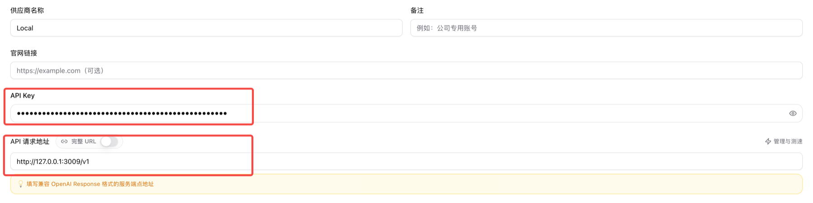

# 客户端接入指南

本文档说明如何将 ChatGPT/Codex 或 Claude Code 连接到 AI Cockpit。推荐使用 CC Switch 管理配置，也可以直接编辑客户端配置文件。

## 开始前准备

如果当前网络无法直接访问 ChatGPT/Codex 或 Claude Code，请先按照 [网络与代理配置](网络与代理配置.md) 启用 VPN 或网络代理。CC Switch 只管理客户端供应商配置，不提供 VPN、代理节点或订阅服务。

连接客户端前，请先在 AI Cockpit 中完成以下操作：

1. 添加至少一个可用账号。
2. 在设置页的“令牌管理”中添加访问令牌，并复制完整令牌。
3. 确认服务端口，默认是 `3009`。
4. 启动服务，确认应用左上角显示“运行中”。

客户端填写的是 AI Cockpit 生成的访问令牌，不是 ChatGPT Access Token，也不是上游 API Key。

## 推荐：通过 CC Switch 配置

[CC Switch](https://github.com/farion1231/cc-switch/) 是独立的开源客户端配置管理工具，可以用可视化界面管理 Codex 和 Claude Code 的供应商配置。

### 下载与安装

前往 [CC Switch 最新版本下载页面](https://github.com/farion1231/cc-switch/releases/latest)，选择与系统匹配的安装包：

- macOS：优先下载 `.dmg`。Apple 芯片选择 ARM64，Intel 芯片选择 x64。
- Windows：下载 `.exe` 或 `.msi`，按照安装向导完成安装。

安装包和软件更新均由 CC Switch 项目发布页面提供。

### 配置 ChatGPT / Codex

1. 打开 CC Switch，进入 **Codex** 页面。
2. 点击添加供应商，选择自定义配置。
3. 供应商名称填写 `AI Cockpit`。
4. API Key 填写 AI Cockpit 生成的访问令牌。
5. API 请求地址填写 `http://127.0.0.1:3009/v1`。
6. 保持“完整 URL”关闭。
7. 保存供应商，并将当前供应商切换为 `AI Cockpit`。
8. 完全退出并重新打开 ChatGPT/Codex。



该配置用于 ChatGPT 桌面应用中的 Codex 功能，也适用于 Codex CLI 和 IDE 扩展，不会改变 ChatGPT 普通对话使用的服务。

### 配置 Claude Code

1. 打开 CC Switch，进入 **Claude** 页面。
2. 点击添加供应商，选择自定义配置。
3. 供应商名称填写 `AI Cockpit`。
4. API Key 或 Auth Token 填写 AI Cockpit 生成的访问令牌。
5. API 地址填写 `http://127.0.0.1:3009`，末尾不要添加 `/v1`。
6. 保存供应商，并将当前供应商切换为 `AI Cockpit`。

Claude Code 通常可以直接读取切换后的配置。如果请求仍使用旧配置，请完全退出并重新打开 Claude Code。

### CC Switch 的作用范围

CC Switch 在这里负责写入和切换客户端配置。AI Cockpit 已经负责账号路由、配额判断和自动切换，因此不需要再开启 CC Switch 的本地代理或路由接管。

## 不通过 CC Switch 直接配置

### ChatGPT / Codex

打开 ChatGPT 的“设置 > 配置 > 打开 config.toml”，或直接编辑：

```text
macOS:   ~/.codex/config.toml
Windows: %USERPROFILE%\.codex\config.toml
```

加入以下配置：

```toml
model_provider = "ai_cockpit"

[model_providers.ai_cockpit]
name = "AI Cockpit"
base_url = "http://127.0.0.1:3009/v1"
wire_api = "responses"
env_key = "AI_COCKPIT_API_KEY"
```

将 AI Cockpit 访问令牌保存到 `AI_COCKPIT_API_KEY` 环境变量：

```bash
# macOS
launchctl setenv AI_COCKPIT_API_KEY "<AI Cockpit 生成的访问令牌>"
```

```powershell
# Windows PowerShell
[Environment]::SetEnvironmentVariable("AI_COCKPIT_API_KEY", "<AI Cockpit 生成的访问令牌>", "User")
```

Windows 会持久保存该用户环境变量。macOS 的 `launchctl setenv` 仅对当前登录会话有效，注销或重启后需要重新执行。设置完成后，完全退出并重新打开 ChatGPT/Codex。

### Claude Code

编辑 Claude Code 配置文件：

```text
macOS:   ~/.claude/settings.json
Windows: %USERPROFILE%\.claude\settings.json
```

写入以下配置。如果文件中已有其他内容，只合并 `env` 字段，不要覆盖原有设置。

```json
{
  "env": {
    "ANTHROPIC_BASE_URL": "http://127.0.0.1:3009",
    "ANTHROPIC_AUTH_TOKEN": "<AI Cockpit 生成的访问令牌>"
  }
}
```

保存后重新打开 Claude Code。

## 确认连接成功

1. 保持 AI Cockpit 服务处于“运行中”。
2. 从客户端发起一个新请求。
3. 确认请求可以正常返回，并在 AI Cockpit 首页看到当前使用账号。

如果修改了 AI Cockpit 服务端口，请同步修改客户端配置中的端口。Codex 地址需要保留末尾的 `/v1`，Claude Code 地址不需要添加 `/v1`。
