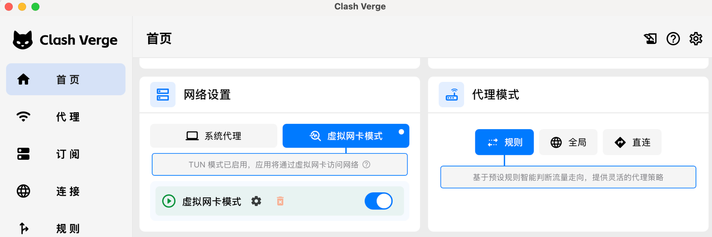
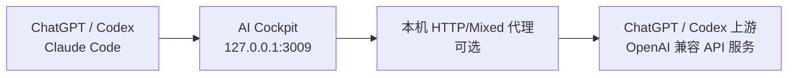
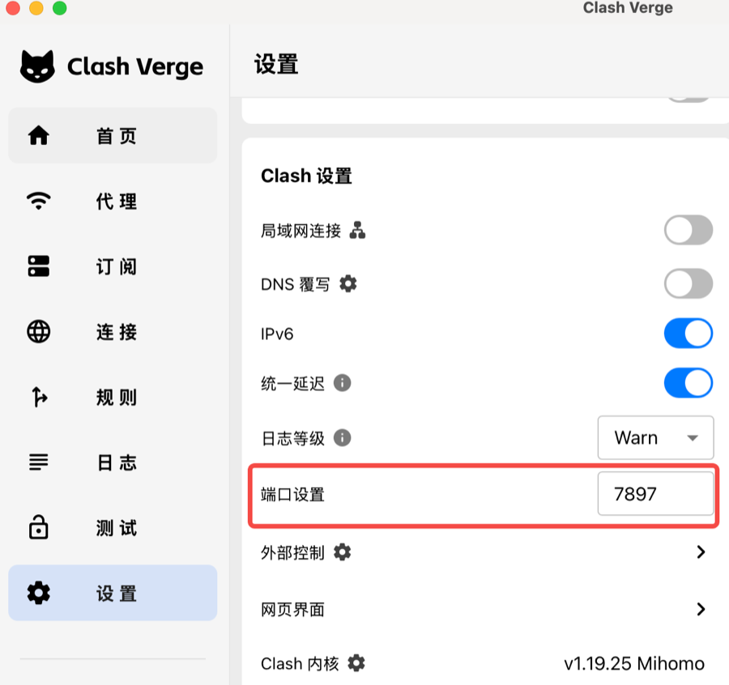

# 网络与代理配置

AI Cockpit 需要访问 ChatGPT/Codex 上游或 API Key 账号配置的第三方接口。网络可以直接访问这些服务时，不需要配置代理；只有上游连接需要经过本机代理软件时，才需要使用代理端口或 TUN 模式。

ChatGPT/Codex 和 Claude Code 是否需要 VPN 或代理取决于用户所在地区、当前网络和上游服务的可用范围。如果当前网络无法直接访问，应先完成网络配置，再启动 AI Cockpit 和客户端。

## 推荐的首次使用流程

需要同时使用 ChatGPT/Codex、Claude Code 和 AI Cockpit 时，推荐使用 **Clash Verge Rev + 规则模式 + TUN/虚拟网卡模式**。这种方式由系统统一处理网络流量，不需要分别为每个应用填写代理端口。

### 1. 下载并安装 Clash Verge Rev

1. 打开 [Clash Verge Rev 最新版本页面](https://github.com/clash-verge-rev/clash-verge-rev/releases/latest)。
2. macOS 根据芯片下载 Apple Silicon 或 Intel 版本；Windows 通常下载 x64 安装包。
3. 安装并打开 Clash Verge Rev。

首次启用 TUN 时，macOS 可能要求添加 VPN 配置或输入管理员密码，Windows 可能要求安装服务、网络组件或允许防火墙访问。只应对从官方项目发布页面下载的安装包授予权限。

### 2. 导入网络服务配置

Clash Verge Rev 本身不提供网络服务。请从可信且合法的网络服务提供方获取订阅链接或配置文件，然后在“订阅”页面导入并更新。

导入后，应能在“代理”页面看到可选择的节点或策略组。不要把订阅链接、账号密码或节点配置发送给他人，也不要提交到 AI Cockpit 仓库。

### 3. 选择可用节点

1. 打开“代理”页面。
2. 选择延迟和可用性正常的节点。
3. 如果软件提供延迟测试，可以先执行测试再选择。

节点不可用时，即使 AI Cockpit 的端口配置正确，上游请求也会连接失败。

### 4. 开启规则模式和 TUN

1. 在首页将“代理模式”设置为“规则”。
2. 开启“TUN”或“虚拟网卡模式”。
3. 确认 TUN 状态显示已启用。
4. AI Cockpit 的“代理端口”保持“未设置”。



规则模式会根据域名决定直连或代理。所用规则需要覆盖 ChatGPT、OpenAI、Anthropic 以及实际 API Key 上游域名。如果规则模式无法连接，可以临时切换到“全局”模式进行诊断；确认是规则问题后，应调整规则或订阅配置。

### 5. 验证网络

启动 AI Cockpit 前，先确认：

- ChatGPT 网页或桌面应用能够正常登录。
- Claude Code 能够正常启动并访问其服务。
- Clash Verge Rev 没有显示节点不可用或连接错误。

### 6. 按顺序启动应用

建议按以下顺序使用：

1. 启动 Clash Verge Rev，确认节点和 TUN 正常。
2. 启动 AI Cockpit 服务。
3. 在 CC Switch 中切换到 AI Cockpit 供应商，或确认手动配置已经生效。
4. 打开 ChatGPT/Codex 或 Claude Code 并发起请求。

如果不想启用 TUN，可以改用本文后面的“填写本机代理端口”方式，只让 AI Cockpit 的上游请求经过代理。此时 ChatGPT/Codex、Claude Code 自身需要另外具备可用的网络环境。

## 代理端口的作用

客户端请求先发送到本机 AI Cockpit，再由 AI Cockpit 请求上游：



代理端口只影响 **AI Cockpit 到上游服务** 的网络请求，不会改变客户端连接 AI Cockpit 的地址，也不会把 `3009` 服务端口变成代理端口。

适合配置代理端口的情况：

- 当前网络无法直接连接上游服务。
- 不想开启全局代理或 TUN，只希望 AI Cockpit 的上游请求经过代理。
- 代理软件提供可用的本机 HTTP 或 Mixed 端口。

以下情况通常不需要填写：

- 当前网络可以直接访问上游服务。
- 已开启 VPN 或代理软件的 TUN/虚拟网卡模式，AI Cockpit 流量已经由系统网络接管。
- API Key 上游可以在当前网络中直接访问。

## 两种配置方式

### 方式一：使用 TUN/虚拟网卡模式

开启代理软件的 TUN 或虚拟网卡模式后，应用流量会通过系统网络路由处理。此时 AI Cockpit 的“代理端口”通常保持“未设置”即可。

这种方式适合希望多个应用统一使用相同网络规则的用户。代理软件使用“规则”模式时，还需要确保 ChatGPT、OpenAI 及实际 API Key 上游域名会命中代理规则，而不是被错误设置为直连。

### 方式二：填写本机代理端口

如果不使用 TUN，或只希望 AI Cockpit 经过代理，可以填写代理软件提供的 HTTP/Mixed 端口：

1. 打开代理软件的设置页面。
2. 找到“端口设置”“Mixed Port”或“HTTP Port”。
3. 记录当前端口，例如截图中的 `7897`。
4. 打开 AI Cockpit 的设置页面。
5. 在“代理端口”中填写 `7897`。



AI Cockpit 会将其解释为：

```text
http://127.0.0.1:7897
```

端口必须提供 HTTP 代理能力。Clash 的 Mixed 端口同时支持 HTTP 和 SOCKS，可以直接使用；仅支持 SOCKS 的独立端口不能填入当前版本的 AI Cockpit。

## 不要填写哪些端口

- 不要填写 AI Cockpit 的服务端口 `3009`。
- 不要填写 Clash 的外部控制端口或控制面板端口。
- 不要照搬示例中的 `7890` 或 `7897`，应以自己代理软件当前显示的端口为准。
- 不要填写其他电脑上的端口；当前版本固定连接本机 `127.0.0.1`。
- 不要填写仅支持 SOCKS5、但不支持 HTTP 的端口。

## 推荐工具

推荐使用 [Clash Verge Rev](https://github.com/clash-verge-rev/clash-verge-rev)：

- 支持 macOS、Windows 和 Linux。
- 提供 TUN/虚拟网卡模式。
- 提供可供 AI Cockpit 使用的 Mixed 端口。
- 可以使用规则、全局或直连模式管理网络流量。

安装包请从 [Clash Verge Rev 最新版本页面](https://github.com/clash-verge-rev/clash-verge-rev/releases/latest) 下载。macOS 根据芯片选择 Apple Silicon 或 Intel 版本，Windows 通常选择 x64 安装包。

Clash Verge Rev 是网络代理客户端，不提供代理节点、订阅或 VPN 服务。AI Cockpit 也不提供这些服务。请自行准备合法可用的网络服务，并遵守所在地区的法律法规及上游服务条款。

其他能够提供本机 HTTP/Mixed 代理端口或 TUN 模式的工具也可以使用，不要求必须安装 Clash Verge Rev。

## 修改后如何生效

- AI Cockpit 未启动服务时：保存端口后，在下次启动服务时使用。
- AI Cockpit 正在运行时：保存端口后会立即更新后续上游请求使用的代理设置。
- 清空代理端口：后续请求恢复为不使用应用内代理配置。

修改后可以刷新一个 Token 账号的额度，或从客户端发起新请求进行验证。

## 连接失败时检查

1. 确认代理软件正在运行。
2. 确认填写的是当前 HTTP/Mixed 端口。
3. 确认代理软件规则允许目标域名经过代理。
4. 确认没有把服务端口、控制端口或 SOCKS-only 端口填入 AI Cockpit。
5. 使用 TUN 模式时，可以先清空 AI Cockpit 的代理端口再测试。
6. 修改端口后重新发起请求，不要只观察之前已经失败的请求。
