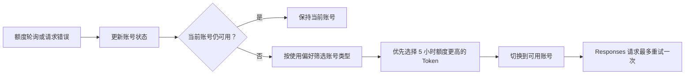

# 账号额度与自动切换

本文档说明 AI Cockpit 如何检查账号、判断可用性，以及在账号不可用时如何选择和重试。

说明：本文描述当前代码的实际行为，不包含尚未实现的计划逻辑。

## 快速了解

| 项目 | 当前规则 |
| --- | --- |
| 额度检查周期 | 每 1 分钟 |
| 单轮检查范围 | 全部 Token 账号 |
| 检查并发数 | 最多同时检查 2 个账号 |
| 单账号超时 | 10 秒 |
| 5 小时额度阈值 | `< 3%` 时不可用 |
| 周额度阈值 | `<= 1%` 时不可用 |
| Responses 自动重试 | 同一请求最多 1 次 |
| API Key 账号 | 不定时检查，仅手动刷新时探测 |



## 额度检查

额度接口为 `/backend-api/wham/usage`。

### 什么时候检查

- 服务启动时。
- 配置热重载后。
- 后台每分钟轮询时。
- 用户手动刷新 Token 账号时。
- 正常请求返回额度数据时。

每轮轮询检查全部 Token 账号，并发上限为 2。如果上一轮尚未结束，下一轮会直接跳过。

已删除或凭证不完整的账号不会请求额度接口：

| 账号状态 | 运行时原因 |
| --- | --- |
| 已删除 | `deleted` |
| 缺少有效凭证 | `missing_credentials` |

### Token 自动续期

当额度接口表明 access token 已失效，且账号配置了 `refresh_token` 时：

1. 请求新的 access token。
2. 将新凭证写回 `openai.json`。
3. 重试一次额度检查。
4. 根据重试结果更新账号状态。

## 可用性判定

额度响应按表格顺序判断，命中后不再继续：

| 优先级 | 条件 | 结果 | 运行时原因 |
| --- | --- | --- | --- |
| 1 | `unauthorized`、`token_revoked` 或凭证被撤销 | 不可用 | `missing_credentials` |
| 2 | 订阅失效、免费计划，或无法确认有效付费计划 | 不可用 | `membership_expired` |
| 3 | `rate_limit.allowed === false` | 不可用 | `rate_limit_not_allowed` |
| 4 | `rate_limit.limit_reached === true` | 不可用 | `rate_limit_reached` |
| 5 | 5 小时剩余额度 `< 3%` | 不可用 | `remaining_below_3%` |
| 6 | 周剩余额度 `<= 1%` | 不可用 | `secondary_remaining_not_above_1%` |
| 7 | 以上条件均未命中 | 可用 | `ok` |

以下异常会直接把账号标记为不可用，原因是 `quota_check_failed`：

- 请求超时或网络失败。
- 非鉴权类的非 2xx 响应。
- 响应内容无法解析。

## 账号选择

### 使用偏好

`routing_preference` 决定允许使用哪些账号：

| 配置值 | 账号类型优先级 |
| --- | --- |
| `token_first` | Token 优先，无可用 Token 时使用 API Key |
| `apikey_first` | API Key 优先，无可用 API Key 时使用 Token |
| `token_only` | 仅允许 Token |
| `apikey_only` | 仅允许 API Key |

### 同类型账号排序

在允许的账号范围内，按以下顺序选择：

1. 当前账号仍可用时保持不变，不因其他账号额度更高而主动切换。
2. 当前账号不可用时，Token 账号按 5 小时剩余额度从高到低排序。
3. 5 小时额度相同或缺失时，按周剩余额度从高到低排序。
4. 额度仍相同时，使用配置数组中索引更小的账号。

### 不参与自动切换的账号

- `auto_switch_disabled: true`：不会成为自动切换目标，但仍可手动使用。
- `deleted_at` 有值：已删除，不能手动或自动使用。
- `enabled === false` 或 `available === false`：不会被自动选择。

如果没有任何可用账号，系统会保留当前未删除且符合使用偏好的账号；当前账号也不符合条件时，返回没有可用账号。

## Responses 请求自动切换

### 生效条件

必须同时满足：

- 当前账号是 Token 模式。
- 请求路径命中 `/responses`。
- 本次请求还没有自动重试过。
- 上游响应命中下表中的可重试错误。

API Key 模式不执行这套 Responses 自动切换。

### 可重试错误

| 返回形式 | 识别内容 | 运行时原因 |
| --- | --- | --- |
| HTTP `429` | `error.type = usage_limit_reached` | `responses_usage_limit_reached` |
| HTTP `429` | `error.type = usage_not_included` | `responses_usage_not_included` |
| HTTP `429` | 文案表示额度已用尽、需要购买 credits 或访问 Codex usage 页面 | `responses_usage_limit_reached` |
| HTTP `401` / `403` | `unauthorized` | `missing_credentials` |
| HTTP `401` / `403` | `token_revoked` 或 `invalidated oauth token` | `missing_credentials` |
| `response.failed` | `insufficient_quota` | `responses_insufficient_quota` |
| `response.failed` | `usage_limit_reached` | `responses_usage_limit_reached` |
| `response.failed` | `usage_not_included` | `responses_usage_not_included` |
| `response.failed` | 文案表示使用额度已用尽 | `responses_usage_limit_reached` |

以下错误当前不会触发自动切换：

- 普通 HTTP `400`、`500`、`503`。
- 未命中规则的 HTTP `429`。
- `context_length_exceeded`、`invalid_prompt`、`server_is_overloaded`、`slow_down`。

### 切换与重试过程

1. 把当前账号标记为不可用，并保存失败原因。
2. 按使用偏好和额度规则重新选择账号。
3. 找到不同账号后丢弃原上游响应。
4. 使用相同请求体重新请求一次。
5. 第二次请求不再切换，避免循环重试。

没有其他可用账号时，原始上游响应直接返回客户端。

### 会话上下文不兼容

切换账号后，旧账号生成的加密上下文可能无法由新账号解密。系统识别到 `invalid_encrypted_content`、`encrypted_content_affinity` 或同类错误时，会返回：

```text
切换账号后旧会话上下文不兼容，请新开会话
```

此时客户端需要创建新会话，系统不会继续自动重试。

## 当前限制

注意：设置页中的顶层 `auto_switch` 会被保存和展示，但当前 Node 运行时没有读取它，因此暂时不能通过该开关关闭自动校正。

当前真正影响运行时选择的是：

- `routing_preference`
- 每个账号的 `auto_switch_disabled`
- 账号的 `enabled`、`available` 和 `deleted` 状态

## 对应代码与测试

实现代码：

- `app/account-manager.js`
- `app/responses-failover.js`
- `openai.js`

回归测试：

- `test/account-manager.test.js`
- `test/openai-admin-refresh.test.js`
- `test/openai-token-refresh.test.js`
- `test/responses-failover.test.js`
- `test/proxy-boundary.test.js`
